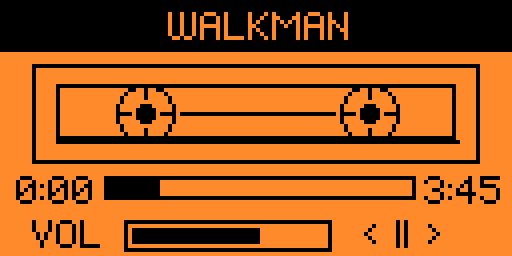
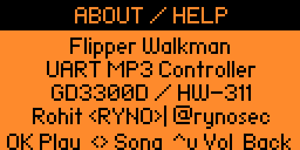
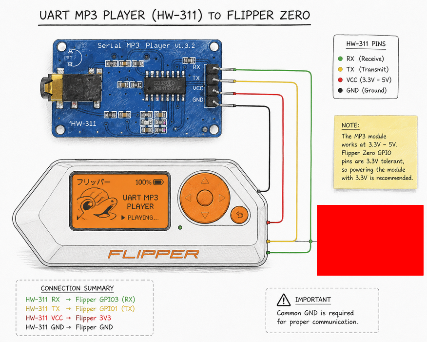

# Flipper Walkman

A retro Walkman-style UART MP3 controller for Flipper Zero.

Created by Rohit Yadav (`rynosec`)
Website: https://ryno.sh
GitHub: https://github.com/rynosec





## What this is

Flipper Walkman is a native Flipper Zero external app (`.fap`) that gives the device a nostalgic cassette-player style UI for controlling a cheap UART MP3 module such as GD3300D / HW-311 / YX5300-family boards.

This is not playing MP3 files from the Flipper itself. The Flipper acts as the controller and UI, while the external UART MP3 module handles the microSD card, MP3 decoding, and audio output.

## Why I built it

This project started from a pretty simple and nostalgic idea: I wanted to see if I could turn the Flipper Zero into something that felt like a tiny old-school Walkman.

Not just a generic hardware remote, but something with its own little personality: physical controls, a cassette-style UI, and the feeling of operating a dedicated music gadget.

Before I landed on the final setup, I thought through a few different hardware routes:

- a DFPlayer Mini style module
- a VS1053 / VS1503 codec-based board
- even a separate ESP32 companion doing part of the work

Those options were interesting, but most of them started pulling the project away from the fun, fast, hobby-friendly build I wanted. They would have meant more custom soldering, more wiring overhead, or more board-level integration work before I could even get to the part I cared about most: making the Flipper feel like a tiny music player.

The breakthrough was stumbling onto the ready-to-go HW-311 style module built around the GD3300D / YX5300 / YX6300 family. It already had the basics I needed, including a pre-soldered 3.5mm jack, which made the whole thing feel much more plug-and-play. That lowered the barrier enough that the project could stay fun instead of turning into a much bigger hardware build.

## Important notes

- This project does NOT play MP3 files from the Flipper Zero itself.
- Flipper Zero acts as the controller and UI.
- The external UART MP3 module handles file storage, MP3 decoding, and audio output.
- Song name display is not implemented yet.
- Most UART MP3 modules in this family do not expose filenames or ID3 metadata over UART, so the app currently controls tracks by module order only.

## Features

- Native Flipper Zero `.fap` app written in C
- Built with uFBT
- Retro cassette / Walkman-inspired UI
- UART control for low-cost MP3 modules
- Playback control from Flipper buttons
- Volume control from Flipper buttons
- About / Help screen
- Tested with a GD3300D / HW-311 style UART MP3 module

## Repository layout

```text
flipper_walkman/
├── application.fam
├── flipper_walkman.c
├── README.md
├── LICENSE
├── .gitignore
└── assets/
    └── screenshots/
        ├── uart-flipper-sketch.png
        ├── walkman-ui-1.png
        ├── walkman-ui-2.png
        └── walkman-ui-3.png
```

## Hardware required

- Flipper Zero
- UART MP3 Player module (GD3300D / HW-311 / YX5300 style)
- microSD card for the MP3 module
- 3.5mm headphones or amplified speaker connected to the module
- Jumper wires

## Wiring

Connection summary:

```text
Flipper Zero              UART MP3 Module
------------              ----------------
TX  --------------------> RX
RX  <-------------------- TX
GND --------------------> GND
3.3V -------------------> VCC
```

Wiring sketch:



Practical notes:

- `3.3V` worked in current testing.
- Some MP3 modules may behave better on `5V`, depending on the exact board revision.
- Always share GND between the Flipper and the module.
- Audio output comes from the MP3 module, not the Flipper.

## SD card preparation

The cheap GD3300D / YX5300 style modules can be picky about how files are arranged.

Use this exact structure:

- Create a folder in the root of the microSD card named exactly `01`
- Put your MP3 file inside that folder
- Rename the file to exactly `001.mp3`

Important note:

> The GD3300D / YX5300 chip cannot read a file sitting loosely in the root directory. It requires a precise folder and naming structure to register the files.

Recommended setup:

- Use a microSD card that is `32GB or smaller`
- Format it as `FAT32`
- Then copy your file into `01/001.mp3`
- After that, control it with your Flipper Zero through the app

Additional notes:

- The Flipper app does not read audio files directly.
- Track ordering is determined by the MP3 module's own indexing / firmware behavior.
- On many cheap UART MP3 boards, the visible filename is not available over the serial protocol.
- If track order looks odd, try re-copying files in the order you want or reformatting the card and copying them fresh.

## Build instructions

This app is structured as a Flipper external application with an `application.fam` manifest. According to the official Flipper application docs, `application.fam` defines app metadata, dependencies, entry point, and `.fap` packaging details.

Prerequisites:

- uFBT installed and working
- Flipper toolchain pulled by uFBT

Build steps:

```bash
cd /home/ryno/Tools/CustomTools/flipper_walkman
ufbt faps
```

Expected output:

- Built app package: `dist/flipper_walkman.fap`
- Debug ELF: `dist/debug/flipper_walkman_d.elf`

Helpful uFBT commands:

```bash
ufbt launch              # build, upload, and start over USB
ufbt cdb                 # regenerate compile_commands.json
ufbt lint                # run linter
ufbt format              # format C code
```

## Install instructions

Option 1: manual copy

- Build the app with `ufbt faps`
- Copy `dist/flipper_walkman.fap` to your Flipper SD card
- Place it under:

```text
/ext/apps/GPIO/flipper_walkman.fap
```

Because this app uses `fap_category="GPIO"`, it will appear under the GPIO app category on the device.

Option 2: USB workflow

```bash
cd /home/ryno/Tools/CustomTools/flipper_walkman
ufbt launch
```

That builds and attempts to upload/start the app over USB.

## Controls

- `OK` → play / pause toggle
- `Left` → previous track
- `Right` → next track
- `Up` → volume up
- `Down` → volume down
- `Long OK` → About / Help
- `Back` → pause / return behavior inside app flow
- `Long Back` → exit app

## Screenshots

Main UI:


## Troubleshooting

### App launches but the module does nothing
- Re-check TX/RX crossover wiring.
- Make sure GND is shared.
- Confirm the module is actually powered.
- If `3.3V` is unreliable on your board revision, test with the module's required supply voltage.
- Make sure your module expects UART control at the baud rate used by the app.

### No audio comes out
- Remember: audio output is from the MP3 module, not the Flipper.
- Plug headphones/speaker into the MP3 module.
- Verify the module itself can play files from its microSD card.
- Check volume on both the app and your speaker/headphones chain.

### Track order is weird
- Cheap UART MP3 modules often use internal file indexing instead of human-readable names.
- Reformat the microSD card and copy files again in the desired order.
- Keep filenames simple.
- For initial testing, use the strict `01/001.mp3` structure first before trying more files.

### Song names do not appear
- This is expected right now.
- Most modules in this family do not expose filenames or ID3 metadata over UART.
- A future workaround is to maintain a playlist mapping file on the Flipper SD card that maps track numbers to names.

### Build fails in uFBT
- Make sure uFBT is installed correctly.
- Run `ufbt update` if your SDK is stale.
- Check that `application.fam` is valid and the app entry point matches the C symbol.
- Regenerate your compile database with `ufbt cdb` if your editor environment looks stale.

## Roadmap

- Add track number display polish
- Add optional playlist mapping file on Flipper SD card to map track numbers to song names
- Improve module compatibility notes for GD3300D / HW-311 / YX5300 variants
- Add better transport/status indicators
- Explore richer progress / elapsed-time behavior
- Investigate friendlier packaging for Flipper Apps Catalog submission

## Credits

- Rohit Yadav / `rynosec`
- Flipper Zero developer documentation: https://developer.flipper.net/flipperzero/doxygen/applications.html
- uFBT tooling
- The many low-cost UART MP3 modules that make weird fun hardware projects possible

## License

MIT — see `LICENSE`.
